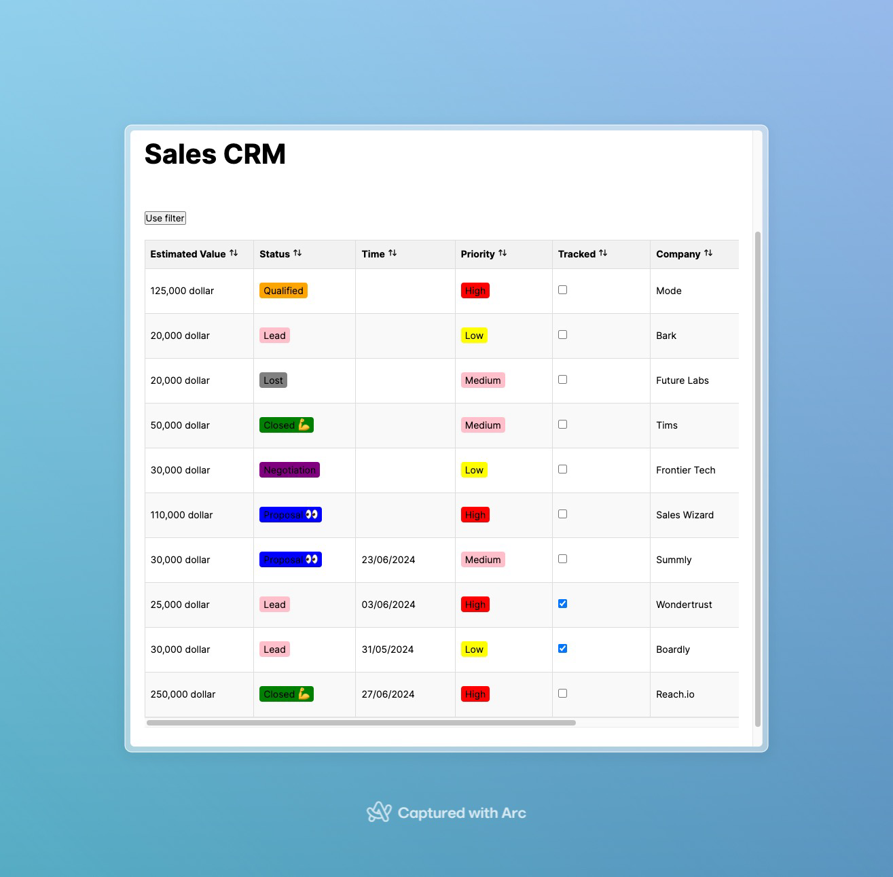

# Momos Assignment - Web

This is an attempt to solve the Momos Assignment.

## Requirements

### 1. Build a table view UI for Notion databases

- a. Implement a basic table view given a Notion database as input
  Notion Table View and Filters 1
- b. Support sorting (see Sort doc)
- c. Support rearrangement and resizing of columns - expected behavior:

  i. Click and hold the column headings to drag them left or right

  ii. Resize columns by hovering over their edges, and dragging right or left

### 2. Build a Notion filter UI for supporting database filters (see Filters doc)

- a. Support the property types checkbox , date , multi_select , number , rich_text ,
  select , timestamp , status
- b. Support Compound filters with filter groups (see Compound filter conditions
  doc)

  The Notion API doc notes that it only supports two levels of nesting on compound filter conditions. Implement the filters such that the restriction on the levels of nesting is configurable e.g. could be increased to 3, 4, or more

- c. Implement unit tests for the Compound filters

## Progress

The first requirement is completed. The table view is implemented with sorting, rearrangement, and resizing of columns.

The second requirement is partially completed. The filter UI is implemented with support for property types `checkbox`, `multi_select`, `number`, `rich_text`, `select`, `timestamp`, `status`. The compound filters are not implemented yet.

## How to run

Create an environment file `.env` inside server dir with the following content:

```env
NOTION_SECRET="secret_xxx"
NOTION_DATABASE_ID="xxx"
```

Then run the following commands to start the server:

```bash
cd server
npm install
npm start
```

To run the client, run the following commands:

```bash
cd client
npm install
npm start
```

The client will be available at `http://localhost:3000`.

## Screenshots


